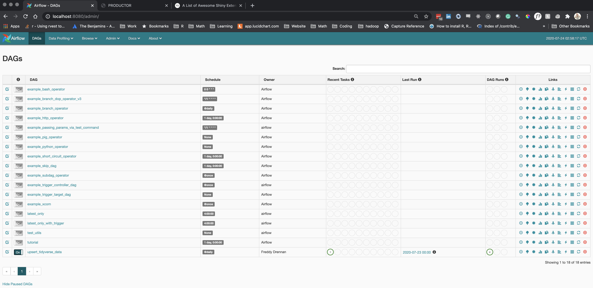
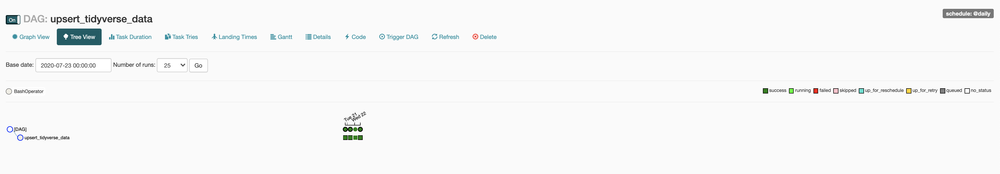
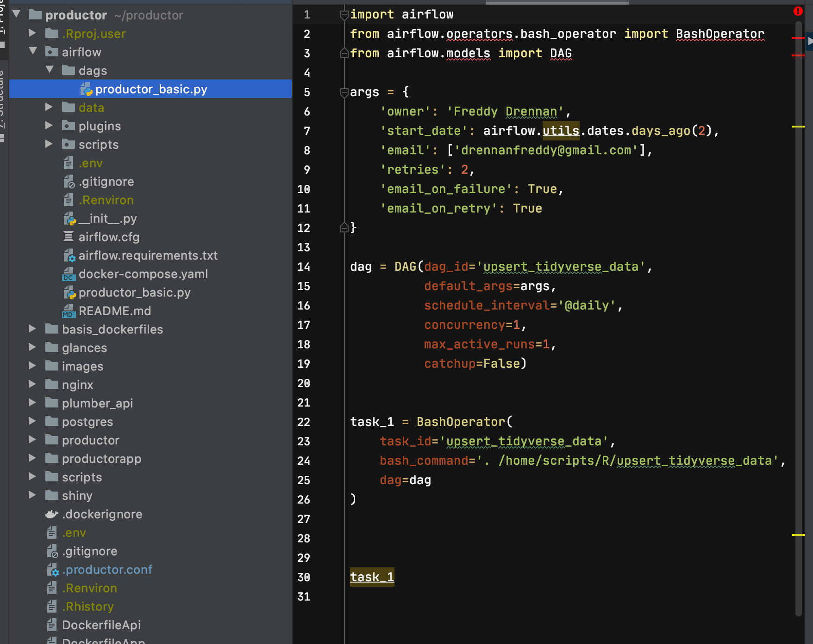
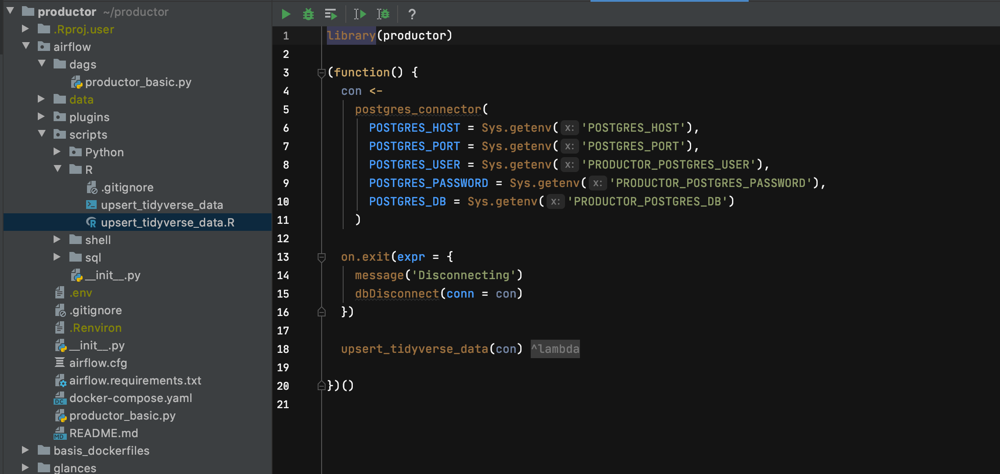
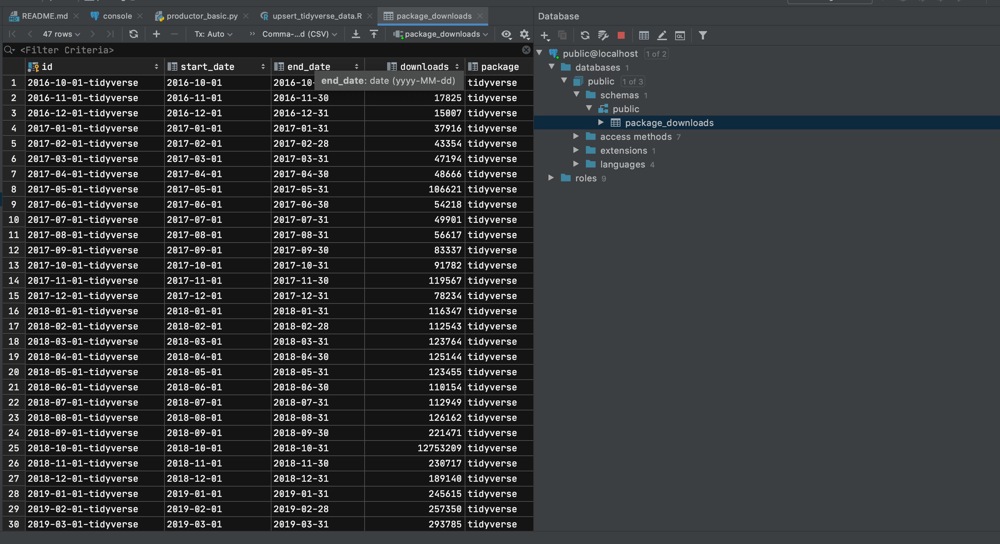
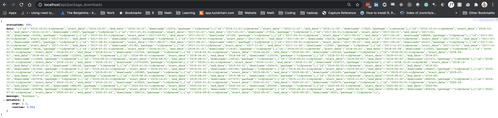
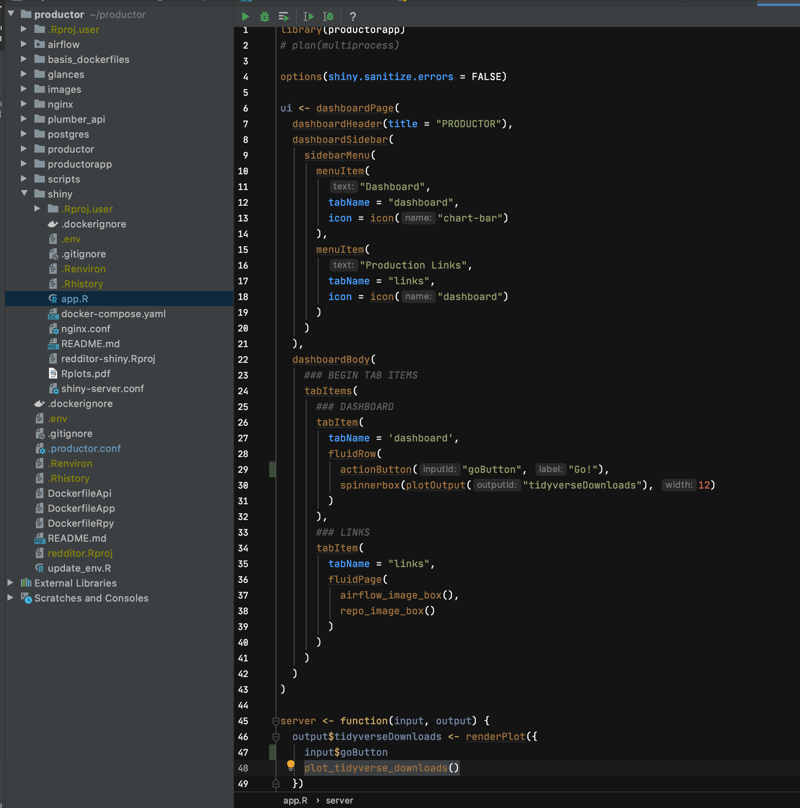

# PRODUCTOR 

This project was created to be a template for a data science project. Out of the box, you get fully connected Airflow,
Postgres, R Packages, load balanced APIs through NGINX, and Shiny knitted together by Docker.

When the project is built, go to `localhost:8080` and turn on the `upsert_tidyverse_data` dag.

This will take data from the `dlstats` package and upsert the data into Postgres. 

See the following files. Airflow doesn't have a native R executor, so you need to wrap the `Rscript` argument in a 
bash script. `airflow/dags/productor_basic.py` executes `airflow/scripts/R/upsert_tidyverse_data`, airflow bash script
which kicks off `airflow/scripts/R/upsert_tidyverse_data.R`

```
airflow/dags/productor_basic.py
airflow/scripts/R/upsert_tidyverse_data
airflow/scripts/R/upsert_tidyverse_data.R
```










## Update `.productor.conf`
If using in production, add `.productor.conf` to your `.gitignore` file in the home directory.
```
# MUST UPDATE FOR YOUR SYSTEM, GET YOUR LOCAL IP ADDRESS (STARTING WITH 192, though ifconfig)
# Use the following command to get your IP
# ifconfig en0 | grep inet | grep -v inet6 | awk '{print $2}'
PRODUCTOR_HOME=/Users/fdrennan/productor
NGINX_HOST_NAME=192.168.0.33 #  ifconfig en0 | grep inet | grep -v inet6 | awk '{print $2}'
POSTGRES_HOST=192.168.0.33   #  ifconfig en0 | grep inet | grep -v inet6 | awk '{print $2}'
AIRFLOW_HOST=192.168.0.33    #  ifconfig en0 | grep inet | grep -v inet6 | awk '{print $2}'


# OPTIONAL
AIRFLOW__CORE__FERNET_KEY=lPWLoH65nZPnY6O-SrhlQsYBF1I2VuPx8NYTucdWpD4=%
AIRFLOW_USER=airflow
AIRFLOW_PASSWORD=airflow
AIRFLOW_DB=airflow

PRODUCTOR_POSTGRES_USER=admin
PRODUCTOR_POSTGRES_PASSWORD=password
PRODUCTOR_POSTGRES_DB=public
POSTGRES_PORT=5432
```

## Getting Started 
``` 
## Go to the working directory for productor
cd productor

Rscript update_env.R # ONLY AFTER UPDATING .productor.conf
Rscript scripts/build.R # Take a nap, runs for a while
Rscript scripts/start.R
```

## Stopping
```
Rscript scripts/stop.R
```

### Notable Locations
#### Shiny
http://localhost/

#### API
http://localhost/api/package_downloads

#### Airflow
http://localhost:8080


### Update Docker Repo
```
docker tag local-image:tagname new-repo:tagname
docker push new-repo:tagname
```